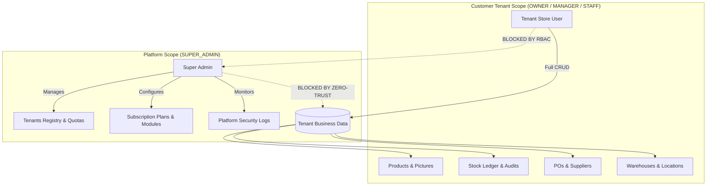

# InfinityHub — Comprehensive Web Platform Documentation

> **Platform Version**: 1.0.0 Enterprise SaaS  
> **Architecture**: Multi-Tenant, Multi-Product Monorepo (Web App + Native Mobile + Shared Packages)  
> **Frontend Stack**: React 19, TypeScript, Vite, Tailwind CSS, Lucide Icons  
> **Last Updated**: September 2026

---

## 1. Executive Summary & Core Architecture

**InfinityHub** is a production-grade, multi-tenant Business Software-as-a-Service (SaaS) platform built to deliver isolated, specialized business applications on top of a unified platform infrastructure.

Unlike legacy monolithic software that forces every feature into a single interface, InfinityHub operates on a **Decoupled Multi-Product Architecture**:
1. **The Platform Layer**: Handles marketing, app catalog discovery, self-service tenant provisioning, subscription lifecycle management, and Super Admin oversight.
2. **Dedicated Business Workspaces**: Each customer subscribes to a dedicated application tailored strictly to their operational requirements (starting with **Inventory Management & Supply Chain Control**), ensuring a clean, focused user experience with zero cross-product clutter.

```
                                  INFINITYHUB
                           Global SaaS Infrastructure
                                       │
        ┌──────────────────────────────┴──────────────────────────────┐
        ▼                                                             ▼
┌──────────────────────────────┐                       ┌──────────────────────────────┐
│     PLATFORM OPERATOR        │                       │    CUSTOMER WORKSPACES       │
│  (Super Admin Portal /admin) │                       │  (Isolated Tenant Domains)   │
├──────────────────────────────┤                       ├──────────────────────────────┤
│ • Tenant Lifecycle & Quotas  │                       │ • Kumar Stores (Mobile Shop) │
│ • Subscription Plans & Tiers │                       │ • ABC Supermarket (Groceries)│
│ • Module & Feature Toggles   │                       │ • City Fashion Boutique      │
│ • Global Audit & Security    │                       │ • Apex Electronics Hub       │
└──────────────────────────────┘                       └──────────────────────────────┘
```

---

## 2. Zero-Trust Security & Data Isolation Boundary

The web application strictly enforces an architectural boundary separating the **Platform Operator (Super Admin)** from **Tenant Business Data**:



### Access Isolation Rules:
* **Super Admin Scope (`SUPER_ADMIN`)**: Controls tenant status (Active, Trial, Suspended, Provisioning), plan upgrades, feature flag entitlements, and system metrics. Super Admins are strictly prohibited from inspecting private business financials, supplier purchase prices, or proprietary inventory catalogs.
* **Customer Tenant Scope (`TENANT_OWNER`, `MANAGER`, `STAFF`)**: Full operational autonomy within their tenant workspace. Users cannot view or modify data belonging to other businesses or access the platform admin dashboard.

---

## 3. Monorepo Structure & Package Hierarchy

InfinityHub is organized as a clean npm workspace monorepo:

```
SaaSProject/
├── apps/
│   ├── web/                        # Main Web Application (Vite + React + Tailwind)
│   │   ├── src/
│   │   │   ├── components/         # Reusable UI library (Button, Modal, Input, etc.)
│   │   │   ├── context/            # Global state (Auth, Tenant, Toast)
│   │   │   ├── data/               # Initial seed data & client data store
│   │   │   ├── layouts/            # TenantLayout, AdminLayout, AuthLayout
│   │   │   ├── pages/              # Domain pages (Admin, Inventory, Platform, Settings)
│   │   │   ├── routes/             # Route configurations and permission guards
│   │   │   └── services/           # Service abstractions (Auth, Tenant, Stock)
│   └── mobile/                     # React Native CLI Mobile App (Android & iOS)
│
├── packages/
│   ├── types/                      # Canonical TypeScript models (Tenant, Product, User, etc.)
│   ├── constants/                  # Roles, permissions, status codes, default plans
│   ├── validation/                 # Zod validation schemas for forms and entities
│   ├── ui/                         # Design tokens, formatters, and color utilities
│   └── config/                     # Shared ESLint, TSConfig, and build presets
│
└── package.json                    # Monorepo root scripts
```

---

## 4. Web Application Route Directory & Sitemap

### 4.1 Public & Onboarding Routes
| Route | Page Component | Description |
|---|---|---|
| `/` | Redirect | Automatically directs new visitors to `/platform` |
| `/platform` | `PlatformOverviewPage` | Public showcase of InfinityHub SaaS capabilities, platform features, and testimonials |
| `/apps` | `AppsCatalogPage` | Marketplace of standalone business applications (Inventory, POS, Restaurant, etc.) |
| `/apps/:appId` | `AppDetailPage` | Feature breakdowns, pricing tiers, and direct "Start Provisioning" calls to action |
| `/provision` | `ProvisioningPage` | 3-step customer onboarding wizard to register, pick plan, and initialize isolated store |
| `/login` | `LoginPage` | Authentication portal with eye reveal for passwords and role-based redirect |
| `/forgot-password` | `ForgotPasswordPage` | Self-service credential reset workflow with verified security questions |

### 4.2 Super Admin Platform Management (`/admin`)
| Route | Page Component | Description |
|---|---|---|
| `/admin` | `AdminDashboardPage` | Platform metrics: total tenants, MRR, active users, system health |
| `/admin/tenants` | `AdminTenantsPage` | Directory of all tenant stores with status filters, search, and action toggles |
| `/admin/tenants/:id` | `AdminTenantDetailPage`| Per-tenant quota controls, plan changes, user seats, and account suspension |
| `/admin/plans` | `AdminPlansPage` | Subscription plan configuration (Starter, Business, Enterprise pricing & limits) |
| `/admin/modules` | `AdminModulesPage` | Feature catalog and module toggles across the platform |
| `/admin/users` | `AdminUsersPage` | Global directory of platform operators and account owners |
| `/admin/audit-logs` | `AdminAuditLogsPage` | Immutable audit log of all administrative actions, logins, and status updates |

### 4.3 Tenant Inventory Workspace (`/dashboard`, `/inventory/*`)
| Route | Page Component | Description |
|---|---|---|
| `/dashboard` | `DashboardPage` | Real-time KPI cards, low stock alerts, quick actions, and recent activity trail |
| `/products` | `ProductsPage` | Full product catalog supporting **List View** & **Grid View**, search, and category filters |
| `/products/new` | `NewProductPage` | Multi-field product creation with barcode generator and visual preset picker |
| `/products/:id` | `ProductDetailPage` | In-depth product view: stock per warehouse, pricing, margin, movement history |
| `/products/:id/edit`| `EditProductPage` | Product attribute updates, visual replacement, and reorder point adjustments |
| `/categories` | `CategoriesPage` | Hierarchical category management and item count tracking |
| `/brands` | `BrandsPage` | Brand directory, manufacturer metadata, and branded inventory filters |
| `/bundles` | `BundlesPage` | Product Bundles & Kits (BOM) with automatic component stock deduction |
| `/warehouses` | `WarehousesPage` | Multi-warehouse locations, bin allocations, and storage capacity |
| `/transfers` | `TransfersPage` | Inter-warehouse stock transfers with dispatch, in-transit, and receiving statuses |
| `/batches` | `BatchesPage` | Lot tracking, batch numbers, manufacturing dates, and automated expiry warnings |
| `/serials` | `SerialsPage` | Individual unit serial number tracking and warranty registration |
| `/stocktake` | `StocktakePage` | Physical inventory count sessions, scanner reconciliation, and variance adjustment |
| `/reorder` | `ReorderPage` | Automated reorder alerts, minimum buffer thresholds, and suggested PO quantities |
| `/bulk-import` | `BulkImportPage` | CSV / Excel bulk data import engine with real-time error validation |
| `/forecasting` | `ForecastingPage` | Demand prediction engine and ABC Pareto inventory classification |
| `/suppliers` | `SuppliersPage` | Supplier directory, contact info, lead times, and active PO histories |
| `/purchases` | `PurchasesPage` | Purchase order ledger tracking Draft, Ordered, Received, and Billed states |
| `/purchases/new` | `NewPurchasePage` | Multi-item purchase order creation with tax calculation and supplier selection |
| `/stock` | `StockPage` | Unified stock ledger with filters for low stock, out of stock, and stock adjustments |
| `/reports` | `ReportsPage` | Financial stock valuation, fast/slow moving analysis, turnover, and PDF/CSV export |
| `/settings/business`| `BusinessSettingsPage` | Store name, contact info, tax registration, currency symbol, and operational settings |
| `/settings/users` | `UsersSettingsPage` | In-store team members, role assignments (`TENANT_OWNER`, `MANAGER`, `STAFF`) |

---

## 5. Flagship Application: Deep-Dive Feature Specifications

### 5.1 Products & Inventory Catalog (List & Grid Views with Visuals)
* **View Modes**: One-click toggle between compact tabular **List View** (for dense data inspection) and rich **Grid View** (card-based view optimized for retail, mobile phone shops, and fashion).
* **Product Pictures Engine**:
  * **Direct Image URLs**: Full support for external CDN / supplier image URLs.
  * **Local Image Upload**: Drag-and-drop or file select with instant base64 conversion and local data persistence.
  * **Curated Presets Library**: Built-in 1-click photo picker tailored for electronics, smartphones, accessories, and FMCG.
  * **Fallback Thumbnails**: Clean initials-based gradient badges when no photo is provided.

### 5.2 Stock Adjustments & Real-Time Audit Ledger
* **Modal Workflow**: Immediate stock adjustment modal accessible directly from product tables, product details, and low-stock alerts.
* **Movement Classification**:
  * `adjustment_increase` / `purchase_received`: Stock additions with cost tracking.
  * `adjustment_decrease` / `damage` / `theft` / `return`: Deductions with mandatory reason logging.
* **Audit Trail**: Every transaction immutably records previous stock, new stock, delta, reason, timestamp, and user ID.

### 5.3 Barcode Studio & Label Printing
* **Barcode Types**: Code-128, EAN-13, and QR Code generation directly in browser without server dependencies.
* **Print Layouts**:
  * Single label thermal roll printer layout (50mm x 25mm / 2" x 1").
  * Multi-label standard A4 / Letter sheet layouts (24 labels per sheet / 3x8 grid).
* **Batch Printing**: Select multiple products to print bulk barcode sheets with store name and pricing.

### 5.4 Warehouses & Multi-Location Stock
* Multi-warehouse allocation per tenant (e.g., Main Retail Store vs. Central Warehouse vs. Airport Branch).
* Real-time bin and rack storage coordinate tracking.
* Inter-warehouse transfer manifests with dispatch and receipt acknowledgment.

### 5.5 Batches, Expiry & Serial Tracking
* **Batches & Expiry**: Tracks batch codes, production dates, and days until expiration with color-coded warning pills (Fresh, Near Expiry < 30 days, Expired).
* **Serial Numbers**: 1-to-1 serial number tracking for high-value electronics and smartphones (IMEI / Serial), tracking unit status (`in_stock`, `sold`, `defective`, `under_repair`).

### 5.6 Demand Forecasting & ABC Pareto Analysis
* **ABC Classification**: Automatically groups inventory into:
  * **Category A** (Top 70-80% value): High-priority focus.
  * **Category B** (15-20% value): Medium-priority buffer.
  * **Category C** (5-10% value): Low-cost bulk items.
* **Stockout Predictor**: Computes daily burn rates to forecast the exact date an SKU will deplete, generating recommended purchase order quantities.

---

## 6. Client State Management & Persistence

```
┌─────────────────────────────────────────────────────────────────┐
│                    GLOBAL APPLICATION STATE                     │
├─────────────────────────────────────────────────────────────────┤
│ • AuthContext: Current user, role, token, login/logout session  │
│ • TenantContext: Active tenant, product list, categories,       │
│   suppliers, stock movements, and tenant-switching handler      │
│ • ToastContext: Non-blocking animated feedback notifications    │
└─────────────────────────────────────────────────────────────────┘
                                │
                                ▼
┌─────────────────────────────────────────────────────────────────┐
│              REACTIVE LOCAL STORAGE PERSISTENCE                 │
├─────────────────────────────────────────────────────────────────┤
│ Keys:                                                           │
│ • `infinityhub_auth_user`   -> Active session & credentials     │
│ • `infinityhub_tenants_data`-> Full multi-tenant data store     │
│ • `infinityhub_active_tenant`-> Current selected workspace      │
└─────────────────────────────────────────────────────────────────┘
```

* **Offline-First Resilience**: All changes (new products, adjustments, purchase orders, settings) instantly sync to `localStorage`, surviving browser reloads and offline usage.
* **Instant Tenant Switching**: The top navigation bar includes a switcher allowing operators to switch between multiple business profiles (e.g., *Kumar Stores - Mobile Accessories* and *ABC Supermarket*) with zero state cross-contamination.

---

## 7. Development & Deployment Operations

### Available NPM Scripts
From the repository root (`D:\Projects\SaaSProject`):

| Script | Command | Purpose |
|---|---|---|
| `npm run dev:web` | `npm run dev --workspace=apps/web` | Starts the Vite development server on `http://localhost:3000` (LAN accessible) |
| `npm run build:web` | `npm run build --workspace=apps/web` | Compiles TypeScript and builds production distribution assets into `apps/web/dist/` |
| `npm run preview:web`| `npm run preview --workspace=apps/web` | Locally previews the production build |
| `npm run start:mobile`| `npm run start --workspace=@infinityhub/mobile` | Starts React Native Metro development server on port 8081 |
| `npm run type-check` | `tsc -b --force` | Runs comprehensive type-checking across all monorepo packages |

### Pre-Configured Test Accounts & Credentials

| Role | Email | Password | Available Workspaces |
|---|---|---|---|
| **Super Admin** | `admin@infinityhub.com` | `admin123` | SaaS Platform Operations (`/admin`) |
| **Tenant Owner** | `owner@kumarstores.in` | `owner123` | Kumar Stores (Mobile & Electronics) |
| **Tenant Owner** | `owner@abcsupermarket.com` | `owner123` | ABC Supermarket (Groceries & FMCG) |
| **Store Manager** | `manager@kumarstores.in` | `manager123` | Operational Inventory Management |
| **Store Staff** | `staff@kumarstores.in` | `staff123` | Catalog view & Stock entry (Restricted settings) |
